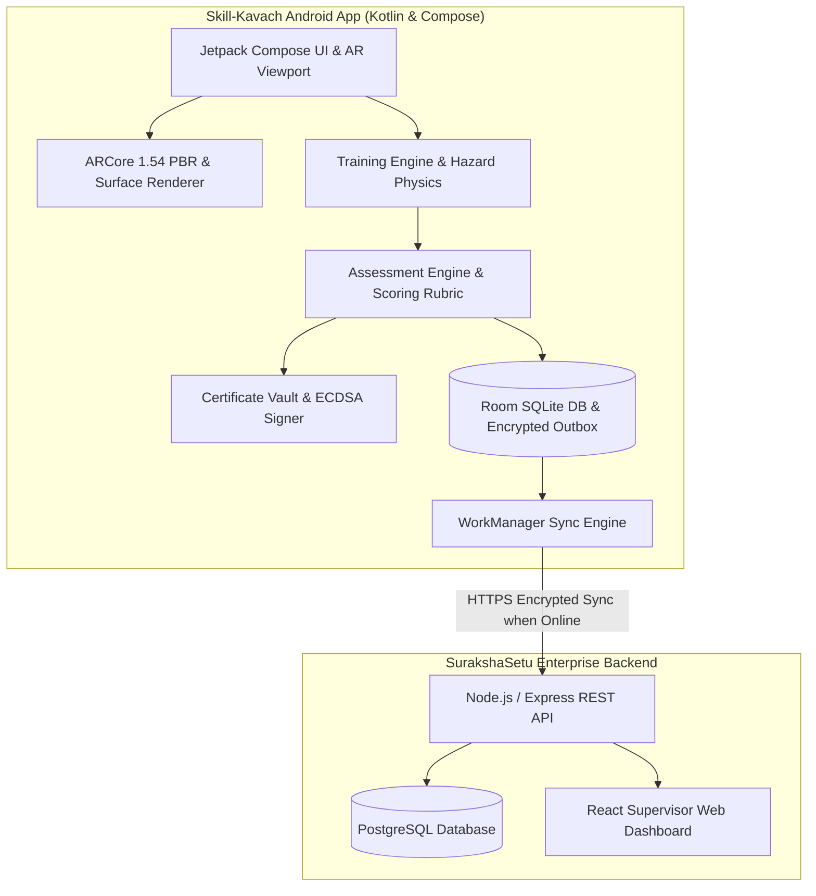

# Skill-Kavach — SurakshaSetu Industrial Safety Platform

**AR-Based Vocational Training Simulator for Industrial Safety**  
*SIH 2026 Problem Statement 26041 — Mining & Manufacturing Sector (Jharkhand)*

[](https://github.com/hemantjawale/Skill-Kavach)
[](https://github.com/hemantjawale/Skill-Kavach)
[](LICENSE)
[](app/build/outputs/apk/release/app-release.apk)

---

## 📋 Overview

**Skill-Kavach** (SurakshaSetu Platform) is an offline-first, multilingual, ARCore-powered industrial safety training and certification ecosystem. Designed specifically for industrial workers, miners, and safety supervisors in high-risk sectors (such as underground mining, steel plants, and heavy manufacturing in Jharkhand), Skill-Kavach converts complex occupational safety protocols into physically calibrated 3D Augmented Reality simulations directly on standard Android mobile devices.

---

## 🎯 Problem & Solution

### The Problem
* **High Occupational Fatality Rates**: Fatal accidents in mining and manufacturing frequently occur due to panic during industrial fires, improper confined-space entry, and gas leak mismanagement.
* **Abstract Classroom Training**: Traditional lectures lack practical spatial awareness, physical muscle memory, and behavioral performance feedback.
* **Language & Literacy Barriers**: Industrial workers in regional industrial belts often speak Hindi or Santali (Ol Chiki script), whereas standard technical safety manuals are published in English.
* **Remote & Underground Connectivity Gaps**: Deep open-pit mines, underground shafts, and industrial plants lack continuous cellular or Wi-Fi internet access, rendering cloud-only apps unusable.

### The Solution
* **3D AR Training Simulations**: Immersive, physically calibrated simulations for **Fire & Explosion Response** (PASS sequence, 3D PBR extinguisher, sweep gestures) and **Gas Leak & Confined Space Entry** (hatch entry, multi-gas LCD detector, rescue tripod, explosion-proof ventilation blower).
* **Clear Practice vs. Assessment Modes**: Practice Mode provides step guidance, target glows, and hints to teach procedures; Assessment Mode objectively evaluates performance by hiding hints and deducting points for errors.
* **100% Offline-First Architecture**: Complete training, evaluation, scoring, and cryptographic certificate issuance execute fully offline on the mobile device. Saved actions queue in an encrypted SQLite outbox and sync automatically via background WorkManager tasks when connectivity is restored.
* **Complete Trilingual Localization & Spoken Voice**: 100% UI, HUD, and TTS voice assistance across **English**, **Hindi (हिन्दी)**, and **Santali (ᱥᱟᱱᱛᱟᱲᱤ - Ol Chiki script)**.
* **Tamper-Proof ECDSA Certificates**: Cryptographic certificates signed using Android Keystore ECDSA (P-256) with embedded QR codes, SHA-256 hash-chain ledgers, and instant offline QR verification.
* **Enterprise Supervisor Dashboard**: Web console for safety managers to track worker compliance, inspect assessment breakdown analytics, verify QR certificates, and audit site readiness.

---

## 🏗️ Architecture & Technology Stack



### Technology Stack Table

| Component Layer | Technology Stack |
| :--- | :--- |
| **Android Mobile App** | Kotlin 2.2+, Jetpack Compose, ARCore 1.54.0, Room SQLite, WorkManager, Android Keystore, OkHttp 4.12 |
| **Backend Service** | Node.js, Express, PostgreSQL, Zod Schema Validation, JWT Authentication with OTP |
| **Supervisor Dashboard** | React 18, Vite, TailwindCSS |
| **Cryptography & Security** | ECDSA (P-256), SHA-256 Hash-Chain Ledger, AES-256-GCM Encryption |

---

## 🥽 AR Training Modules

### 1. Fire & Explosion Response Module
* **Physical Scale Calibration**: 1:1 scale equipment models (e.g. 1.2m extinguisher height) with PBR metallic shaders, pressure gauge needles, and safety pin tags.
* **PASS Safety Protocol Sequence**:
  1. **Identify Emergency Exit**: Confirm an unobstructed retreat route.
  2. **Raise Alarm**: Strobe emergency alarm station and alert control room.
  3. **Inspect Extinguisher**: Verify pressure gauge needle in green zone (100–195 psi) and check tamper seal.
  4. **Pull Safety Pin**: Disengage the yellow metal safety pin.
  5. **Aim Nozzle at Base**: Direct nozzle at the base of burning flames.
  6. **Squeeze Lever**: Discharge fire suppression agent.
  7. **Sweep Gesture**: Drag touch gesture across flame base with particle extinction physics.
  8. **Evacuate Safely**: Retreat to designated assembly point.

### 2. Gas Leak & Confined Space Entry Module
* **Industrial Environment Assets**:
  * Confined space manhole entry hatch with safety barricades.
  * Multi-Gas LCD Detector displaying real-time simulated $O_2$ ($20.9\%$), $H_2S$ ($0\text{ ppm}$), $CO$ ($0\text{ ppm}$), and $LEL$ ($0\%$) concentrations.
  * 3-Leg Heavy Duty Rescue Tripod with winch & safety harness anchor.
  * Standby Attendant NPC & Permit-to-Work board.
  * Portable Explosion-Proof Ventilation Blower with animated fan rotation and directional air flow exhaust.
* **Hazard Simulation Engine**: `HazardDiffusionSimulator` models 3D cellular automaton gas dispersion, gas stratification (heavy vs light gas behavior), safety thresholds, and ventilation airflow dissipation upon blower activation.

> ⚠️ **IMPORTANT SIMULATION DISCLAIMER**: The fire and gas detection mechanics within Skill-Kavach are **software simulations** designed solely for vocational safety procedure training. Skill-Kavach does not contain physical gas hardware sensors or real-world fire detection hardware.

---

## 📊 Assessment Engine & Scoring Rubric

Skill-Kavach features a unified, objective assessment engine (`AssessmentEngine`):

* **Practice Mode vs. Assessment Mode**:
  * **Practice Mode**: Enables step indicators, target highlight glows (`highlightId`), audio guidance, and target selection hints to teach procedure.
  * **Assessment Mode**: Hides target glows and explicit hints; evaluates reaction speed and procedural correctness under realistic conditions.
* **Behavioral Event Logging**: Every action logs a `BehavioralEvent` containing `moduleId`, `stepIndex`, `target`, `actionType`, `timestamp`, `hesitationMs`, and `isCorrect`.
* **Conceptual Weighting Formula**:
  $$\text{Combined Score} = (0.30 \times \text{Quiz Score}) + (0.50 \times \text{Practical Behavioral Score}) + (0.20 \times \text{Oral Voice Score})$$
* **Pass Threshold**: Enforced at **80.0%**. Passing candidates earn a tamper-proof certificate; failing candidates receive actionable improvement suggestions.

---

## 📜 Cryptographic Certificate System

* **Signed Digital Certificates**: Issued via `CertificateVault` using Android Keystore ECDSA (`SHA256withECDSA`) with unique certificate IDs, worker IDs, and hazard domains.
* **Tamper-Proof Ledger**: Uses SHA-256 self-hashes and hash chaining (`prevHash`) to prevent post-issuance tampering.
* **Offline QR Verification**: Certificates generate an offline QR code containing signed JSON payload that can be scanned and validated by supervisors offline using the ZXing verification engine.

---

## 📶 100% Offline-First Architecture

1. **Local Usability**: All AR simulations, assessments, scoring routines, and certificate generation execute locally on device without requiring active internet connectivity.
2. **Encrypted Outbox Queue**: Saved actions and completed assessment results are encrypted using AES-256-GCM and stored in a Room SQLite pending action queue.
3. **Background Sync Engine**: `WorkManager` monitors network state and automatically synchronizes queued outbox payloads to the backend API when internet connectivity is restored.

---

## 🌐 Trilingual Localization & Voice System

Skill-Kavach supports full UI text and TTS spoken voice assistance across three languages:
1. **English (`en`)**: Complete technical safety vocabulary.
2. **Hindi (`hi`)**: Devanagari script localization.
3. **Santali (`sat`)**: Authentic **Ol Chiki script (ᱥᱟᱱᱛᱟᱲᱤ)** localization.

The voice subsystem (`SafetyMitraTutor`) includes strict language-availability guarding: if Santali TTS is unsupported by the device's TTS engine, the system presents visual Ol Chiki text instructions instead of silently falling back to Hindi audio.

---

## 🖥️ Enterprise Supervisor Dashboard

The React-based admin dashboard provides safety officers with:
* **Worker Compliance Roster**: Real-time status of worker safety qualifications and active certificates.
* **Assessment Analytics**: Step-by-step hesitation graphs, mistake trends, and module pass rates.
* **Certificate Verifier**: Web-based QR verification and revocation management.
* **Multi-Tenant Isolation**: Site and organization RBAC enforcement.

---

## 🔒 Security Architecture

* **Authentication**: Email & Employee ID verification via OTP with single-use challenge consumption and 5-attempt lockout rate limiting.
* **Session Security**: Short-lived JWT access tokens with refresh token rotation and immediate replay revocation.
* **Data Protection**: Zero hardcoded secrets, mandatory HTTPS TLS endpoint verification, and AES-256-GCM payload encryption.

---

## ⚡ Automated Test Execution Matrix

Skill-Kavach includes **117 automated unit and integration tests** passing at **100%**:

* **Android Unit & AR Simulation Suite**: 81 tests passing (`./gradlew test`)
* **Node.js Backend & API Suite**: 36 tests passing (`npm test`)

Refer to the detailed test matrix artifact: [Test Execution Matrix](RELEASE_GUIDE.md).

---

## 🛠️ Build & Release Instructions

### Prerequisites
* JDK 17+
* Android Studio Ladybug / Jellyfish (or Android SDK 29+)
* Node.js 18+ & PostgreSQL 14+ (for backend)

### 1. Build Debug APK
```bash
./gradlew assembleDebug
```
Output: `app/build/outputs/apk/debug/app-debug.apk`

### 2. Build Signed Release APK
```bash
./gradlew assembleRelease
```
Output: `app/build/outputs/apk/release/app-release.apk`

### 3. Release Artifact & Checksum
* **Path**: `app/build/outputs/apk/release/app-release.apk`
* **File Size**: `7,172,774 bytes` (~7.17 MB)
* **SHA-256 Checksum**:
  ```
  708fb87804726f93909092d63d7e204e22a9b6474f3bb163a0757ad93660800f
  ```

---

## 📱 SIH 2026 Demonstration Guide

For evaluators and judges reviewing Skill-Kavach for SIH 2026 Problem Statement 26041:

1. **Launch App**: Open Skill-Kavach on an Android 10+ device (Pixel, Samsung, etc.).
2. **Select Language**: Tap the language toggle to test **English**, **Hindi (हिन्दी)**, or **Santali (ᱥᱟᱱᱛᱟᱲᱤ - Ol Chiki)**.
3. **Explore Practice Mode**: Select **Fire Safety** or **Gas Safety** in Practice Mode. Observe 3-step setup guidance, target highlight glows, and voice instructions.
4. **Take Official Assessment**: Switch to **Assessment Mode**. Complete the PASS fire sequence or confined-space gas entry protocol. Take an intentional incorrect step to observe safety feedback and score reduction.
5. **View Assessment Result**: Inspect the Completion Summary card showing Combined Score, Quiz/Practical/Oral breakdown, mistakes count, and improvement suggestions.
6. **Verify Certificate**: Upon achieving $\ge 80\%$, inspect the generated ECDSA signed certificate and scan its QR code using another device or the supervisor verifier.
7. **Test Offline Mode**: Enable Airplane Mode. Complete a module to verify that training, scoring, and certificate issuance function 100% offline.

---

## ⚠️ Known Limitations & Disclaimers

* **AR Device Support**: Requires an ARCore-compatible Android device. On devices lacking ARCore hardware, Skill-Kavach automatically falls back to 2D Practice Mode without crashing.
* **Simulated Sensor Environment**: Gas concentration values ($H_2S, O_2, CO, LEL$) and fire particle physics are realistic software simulations created for educational purposes. They do not replace hardware gas detectors or real-world fire alarms.

---

## 💳 Asset & Reference Credits

* **3D Equipment Models**: Industrial meshes, fire extinguishers, electrical control cabinets, gas entry hatches, and rescue tripods generated and optimized for mobile AR rendering.
* **Icons & Fonts**: Google Material Symbols, Google Noto Sans Devanagari, and Ol Chiki Unicode font rendering.

---

## 📄 License

This project is licensed under the **MIT License** — see the [LICENSE](LICENSE) file for details.
